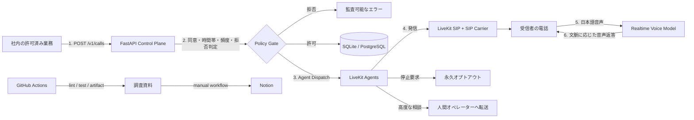

# Japanese AI Outbound Caller


同意済み・依頼済みの相手へ、日本語で電話を発信し、文脈を理解して音声で返答する**オープンソースの制御基盤**です。LiveKit Agents/SIPを中心に、品質優先ではGPT-Realtime-2、監査性優先ではSTT→LLM→TTS、完全OSSではWhisper系＋ローカルLLM＋VOICEVOXへ差し替えられます。

> 無差別な営業電話や拒否後の再発信を目的にしていません。`DRY_RUN=true` が標準で、実発信には同意根拠、時間帯、日次上限、受信者別クールダウン、拒否リストを通過する必要があります。

## 調査結論

- **推奨:** LiveKit Agents + LiveKit SIP + SIPキャリア + GPT-Realtime-2
- **監査重視:** Deepgram/Azure STT → text LLM → ElevenLabs日本語TTS
- **完全OSS:** Asterisk/Jambonz + Kotoba-Whisper/Whisper + local LLM + VOICEVOX
- Typelessは高品質な音声入力・文章整形であり、電話Agentではありません。電話品質には8 kHz音声、相槌、割り込み、無音、留守電、応答開始遅延の評価も必要です。

詳細は [`docs/research.md`](docs/research.md) を参照してください。

## 全体アーキテクチャと処理の流れ



1. 社内システムが電話番号、受信者名、用件、同意根拠を1件ずつ送信します。
2. APIはE.164形式、平日営業時間、日次上限、受信者別クールダウン、拒否リストを検査します。
3. 電話番号はDBへ平文保存せず、pepper付きハッシュと末尾4桁だけを保存します。
4. LiveKitのnamed agentを起動し、確認済み発信番号のSIP trunkから発信します。
5. Agentは会社名、担当、用件、AI音声であることを冒頭で伝え、会話継続を確認します。
6. 相手の文脈を保って短く返答し、停止要求は即時登録、高度な内容は人間へ転送します。

## 実装済み

- `POST /v1/calls`: 制約付きの発信要求
- `GET /v1/calls/{id}`: マスク済み状態確認
- `POST /v1/internal/opt-outs`: Agent専用の永久拒否登録
- `DRY_RUN`: 外部アカウントなしで安全にAPI検証
- LiveKit dispatch / SIP outbound worker / GPT realtime model
- API key、電話番号ハッシュ化、拒否リスト、時間帯、日次上限、クールダウン
- pytest、Ruff、GitHub Actions、artifact、Codespaces/devcontainer、Docker Compose
- Notion Markdown API用の同期スクリプトと手動workflow

## 30秒でローカル検証

```bash
cp .env.example .env
python -m venv .venv
source .venv/bin/activate
pip install -e ".[dev]"
ruff check . && pytest
uvicorn app.main:app --reload
```

`http://localhost:8000/docs` を開きます。初期値は `DRY_RUN=true` なので電話は発信されません。

## 本番に必要なもの

1. LiveKit project（Cloudまたはself-hosted）
2. 日本向け発信が可能なSIP carrier、確認済みcaller ID、outbound trunk
3. `LIVEKIT_URL`、`LIVEKIT_API_KEY`、`LIVEKIT_API_SECRET`、`LIVEKIT_SIP_OUTBOUND_TRUNK_ID`
4. `OPENAI_API_KEY`、または選択したSTT/LLM/TTSのcredentials
5. 強い `APP_API_KEY`、`INTERNAL_API_KEY`、`PHONE_HASH_PEPPER`
6. 人間転送先、監視、プライバシー通知、保存削除規程、対象業務の法務・carrier審査

詳しい初期設定は [`docs/setup.md`](docs/setup.md)、法務・安全策は [`docs/legal-and-safety.md`](docs/legal-and-safety.md) にあります。

## Notion保存

`notion/AI音声電話サービス調査.md` はそのままimportできます。完全自動化する場合はGitHub Secretsへ `NOTION_TOKEN` と `NOTION_PARENT_PAGE_ID` を登録し、Actionsの **Publish research to Notion** を実行します。Notion API version `2026-03-11` のMarkdown page creationを使います。

## 開発

```bash
pip install -e ".[dev,voice]"
ruff check .
pytest --cov=app --cov=scripts
python -m agent.worker dev
```

Repository policyは [`CODEX.md`](CODEX.md)、第三者技術は [`THIRD_PARTY_NOTICES.md`](THIRD_PARTY_NOTICES.md) を参照してください。
