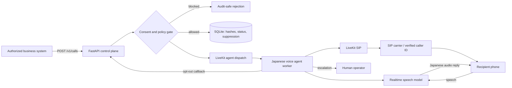

# Architecture

## Goal

A Japanese outbound phone agent that understands conversational context, answers by voice, transfers
to a human, and permanently honors opt-outs. Orchestration is open source; the speech stack can be
swapped between quality-first cloud models and self-hosted components.

## Runtime flow

1. An authorized system submits one E.164 number, name, purpose, and consent basis. There is no
   bulk-blast endpoint.
2. The control plane checks format, business hours, quota, cooldown, and suppression.
3. Only a masked number and peppered hash persist. The full number passes transiently in dispatch.
4. LiveKit starts the named worker; the worker creates an outbound SIP participant and waits for an
   answer.
5. The agent identifies the business, caller, purpose, and AI speech, then asks to continue.
6. An opt-out phrase calls the suppression endpoint. High-stakes requests transfer to a human.

## Voice-stack profiles

| Profile | Stack | Strength | Trade-off |
|---|---|---|---|
| Quality-first | GPT-Realtime-2 speech-to-speech | Low latency, context and prosody | Paid external API |
| Auditable | STT → text LLM → Japanese TTS | Inspectable transcript and normalization | More latency and failure points |
| Self-hosted | Kotoba/Whisper → local LLM → VOICEVOX | Data control and open components | GPU and operations burden |

## Security and privacy

API keys guard endpoints; full phone numbers are not stored. Production should use TLS, secret
manager, a strong pepper, encrypted managed database, RBAC, retention limits, and access logging.
Recording is disabled. Enabling recording requires a purpose, notice, retention/deletion process,
and legal review.

## CI/CD and Notion

GitHub Actions runs lint, tests, source compilation, and uploads the research, architecture, and
Notion-ready Markdown as `japanese-ai-voice-agent-research`. A separate manual workflow publishes
Markdown after Notion secrets are configured.
