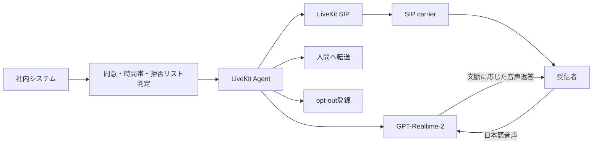

# 日本語AI音声電話サービス調査と実装方針

調査日: 2026-07-03

## 経営判断向け要約

- 第一候補は **LiveKit Agents + SIP + GPT-Realtime-2**。OSSの制御層を自社保有しながら、
  日本語の文脈理解、割り込み、音声返答、転送を高品質に実現しやすい。
- 文字起こしと監査を重視する場合は **Deepgram/Azure STT → LLM → ElevenLabs日本語TTS**。
- 完全OSSは **Kotoba-Whisper/Whisper + local LLM + VOICEVOX + PBX** で可能だが、遅延、GPU、
  電話音響、運用保守の負担が大きい。
- Typelessは電話Agentではなく高品質な音声入力・文章整形製品。電話ではSTT精度に加えて
  turn detection、割り込み、応答開始遅延、留守電判定が品質を左右する。
- 無差別発信は採用せず、同意済み、依頼された折返し、既存顧客、取引通知に限定する。

## 比較表

| 区分 | 候補 | 発信 | 日本語 | コメント |
|---|---|---:|---:|---|
| OSS | LiveKit Agents | ○ | 接続model次第 | 最有力。SIP、転送、tools、self-host |
| OSS | Pipecat | ○ | 接続service次第 | vendor交換性が高い |
| OSS | Vocode/TEN/Siphon | ○/構成可 | 要検証 | 要件別の代替候補 |
| 商用 | OpenAI Realtime | ○ | ○ | speech-to-speech、低遅延、文脈と抑揚 |
| 商用 | Retell/Vapi/Bland | ○ | ○/構成次第 | 電話運用を短期間で構築 |
| 商用 | ElevenLabs Agents | ○ | ○ | 日本語音声とSIP/Twilio連携 |
| 完全OSS | Whisper系 + VOICEVOX | ○ | ○ | 自社運用負荷とlicense確認が必要 |

## 採用アーキテクチャ

## 本番化に必要なもの

LiveKit、SIP carrierと確認済み発信番号、音声model API、secrets管理、monitoring、人間転送先、
privacy通知、保存・削除方針、対象業務に対する法務確認が必要です。

詳細、根拠リンク、評価項目、setupはGitHubの `docs/research.md`、`docs/setup.md`、
`docs/legal-and-safety.md` を参照してください。
